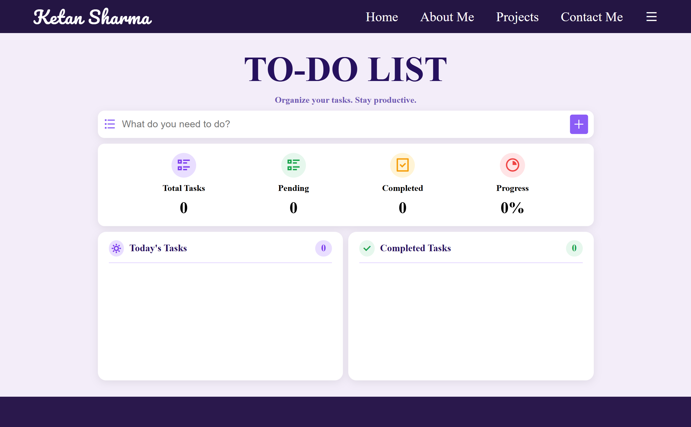
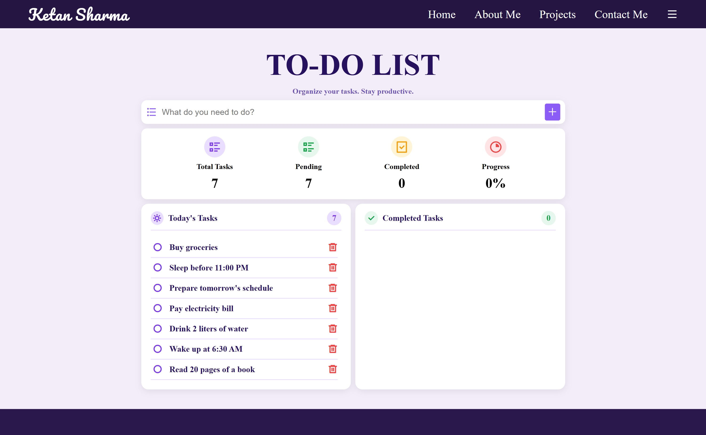
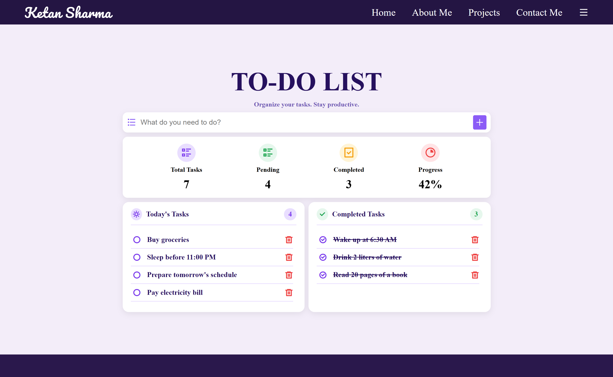
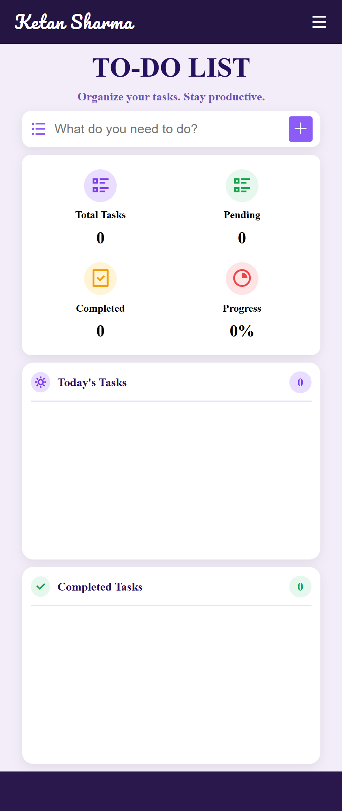
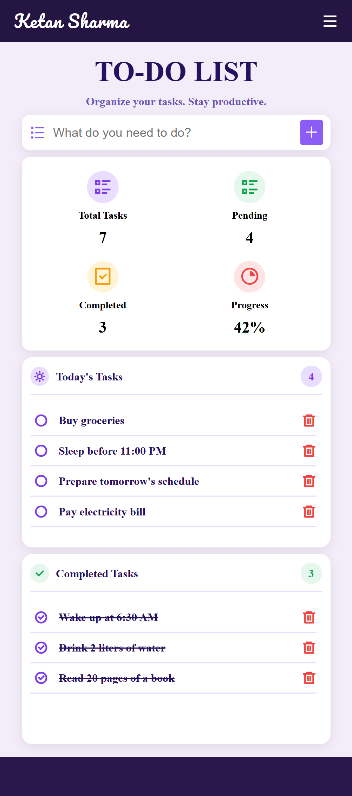
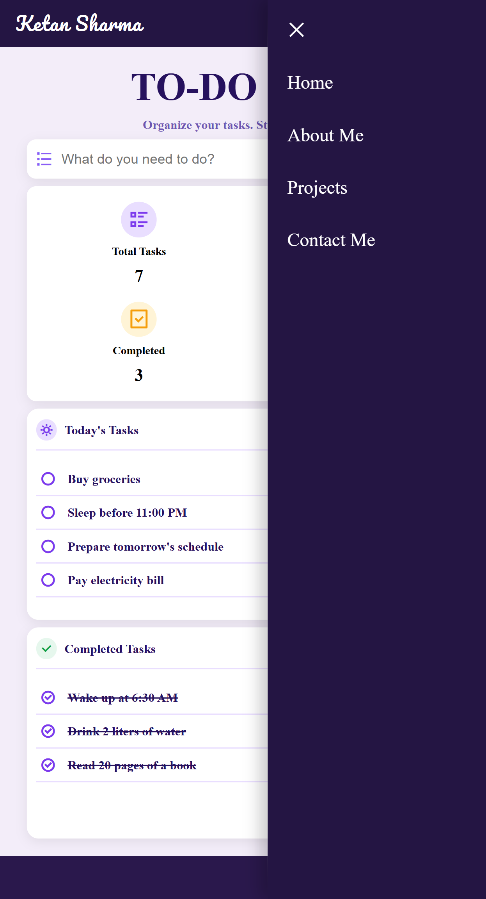
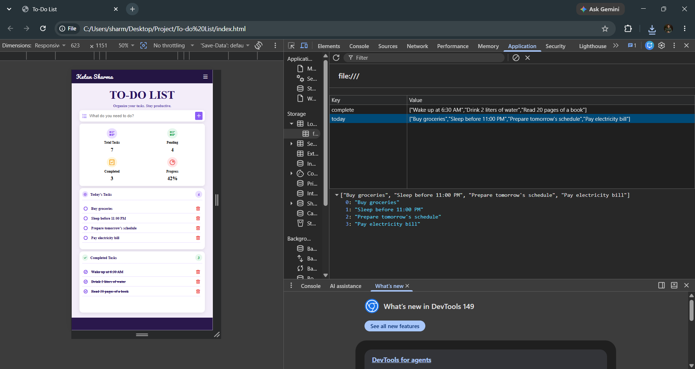

# 📝 To-Do List Web App

A modern and responsive To-Do List application built using **HTML**, **CSS**, and **JavaScript**. It helps users organize tasks, track their progress, and automatically saves data using the browser's Local Storage.

---

## 🎥 Demo

> Upload `demo.mp4` to GitHub and paste the generated video link here.

---

# 📸 Screenshots

## Desktop Home



---

## Add Task



---

## Completed Tasks



---

## Mobile Home



---

## Mobile View



---

## Sidebar Navigation



---

## Local Storage



---

# ✨ Features

- ✅ Add new tasks
- ✅ Mark tasks as completed
- ✅ Move completed tasks back to pending
- ✅ Delete tasks
- ✅ Live task statistics
- ✅ Progress tracking
- ✅ Data persistence using Local Storage
- ✅ Responsive design
- ✅ Mobile sidebar navigation

---

# 🛠️ Tech Stack

- HTML5
- CSS3
- JavaScript (ES6)
- Local Storage (Web API)
- Remix Icons
- Google Fonts

---

# 📂 Project Structure

```text
todo-list-web-app/
│
├── assets/
│   ├── desktop-home.png
│   ├── add-task.png
│   ├── completed-task.png
│   ├── mobile-home.png
│   ├── mobile-view.png
│   ├── sidebar.png
│   ├── local-storage.png
│   └── demo.mp4
│
├── index.html
├── style.css
├── script.js
└── README.md
```

---

# 👨‍💻 Author

**Ketan Sharma**

GitHub: https://github.com/ketansharma-ops

---

⭐ If you found this project helpful, consider giving it a star!
